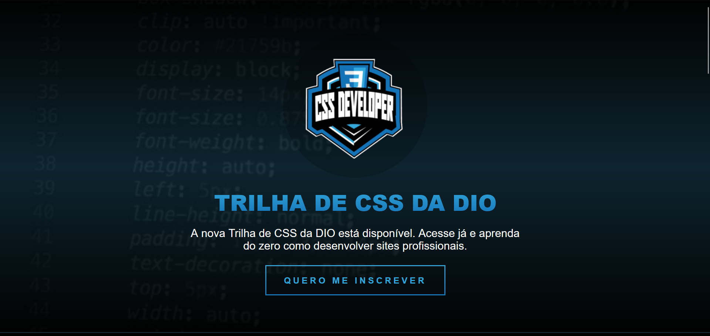
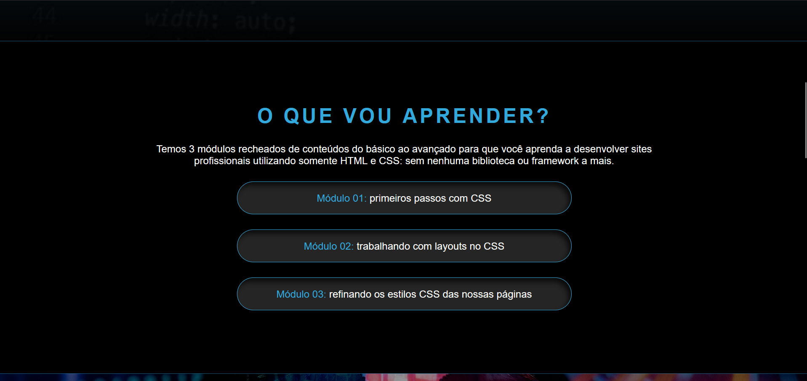
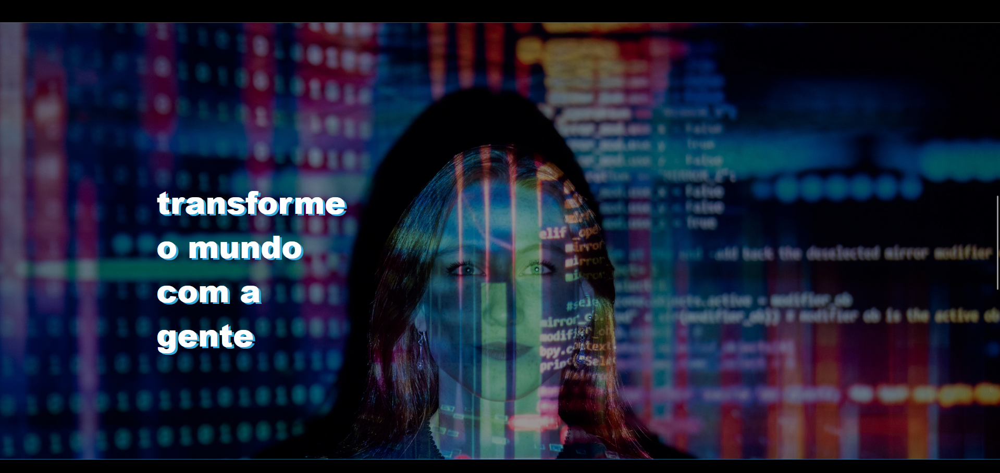
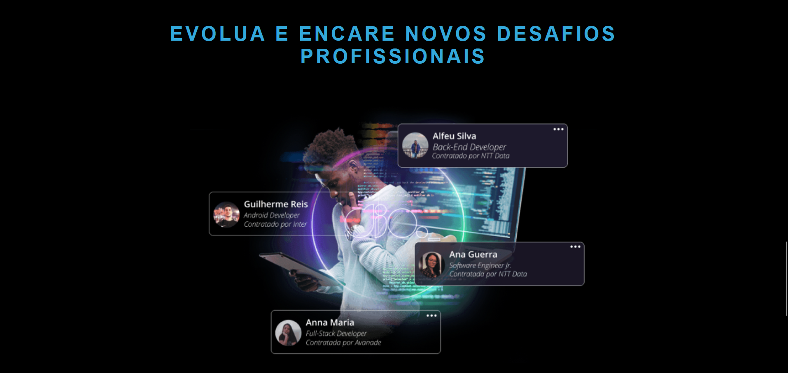
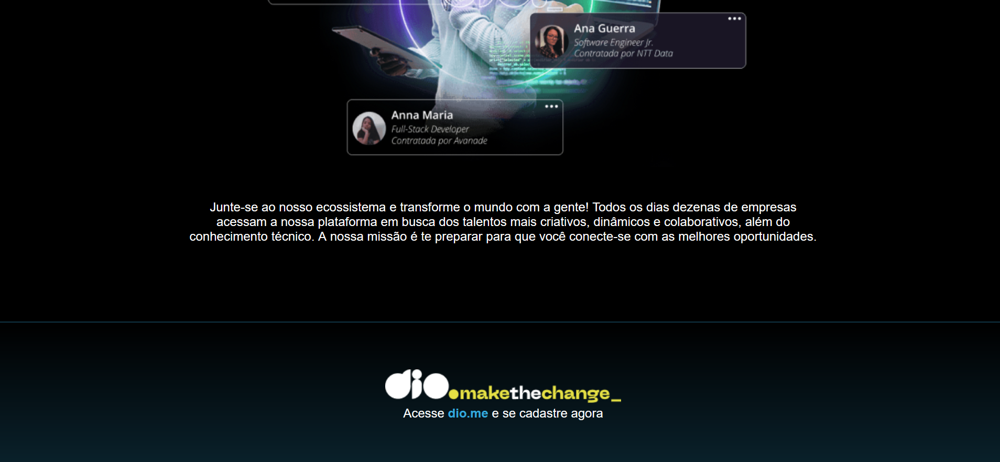

# Projeto de Estilização Avançada - Potência Teck iFood

Este projeto faz parte do Bootcamp de Desenvolvimento de Games da Digital Innovation One, na trilha de CSS. O objetivo deste projeto foi aplicar conceitos avançados de estilização para criar uma experiência visual aprimorada.

## Descrição

O Potência Teck iFood é um projeto que demonstra a aplicação prática de técnicas avançadas de estilização utilizando CSS. O foco principal foi criar uma interface de usuário atraente e funcional, incorporando os princípios fundamentais do design responsivo.

## Recursos Utilizados

- **HTML 5:** Para criar o layout base.
- **CSS 3:** Utilização de seletores avançados, efcombiinações de imagens e outras técnicas para estilização.
- **Responsividade:** Design adaptativo para garantir uma experiência consistente em diferentes dispositivos.


## Capturas de Tela












## Como Executar o Projeto

1. Clone o repositório:

```bash
git clone https://github.com/seu-usuario/potencia-teck-ifood.git
```

2. Abra o arquivo index.html com um navegador de sua preferência.


Aprecie a experiência visual criada com as técnicas de estilização em CSS.

## Contribuições
Contribuições são bem-vindas! Sinta-se à vontade para abrir uma issue ou criar um pull request.

